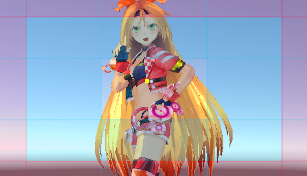
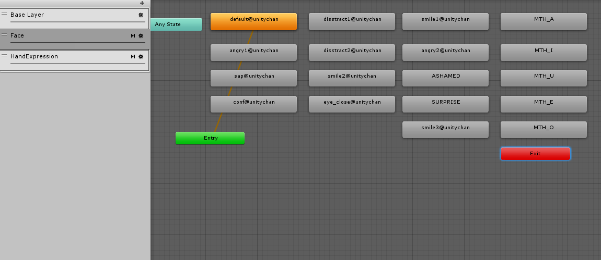
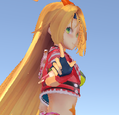
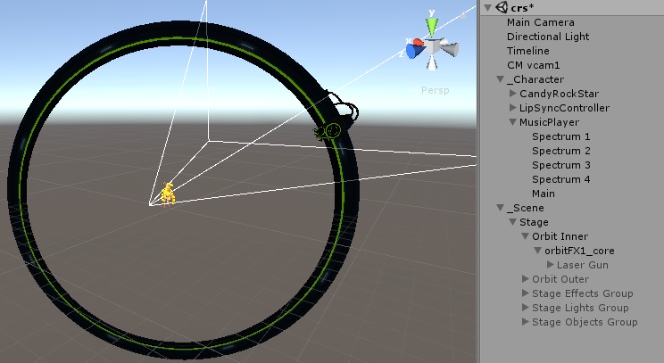
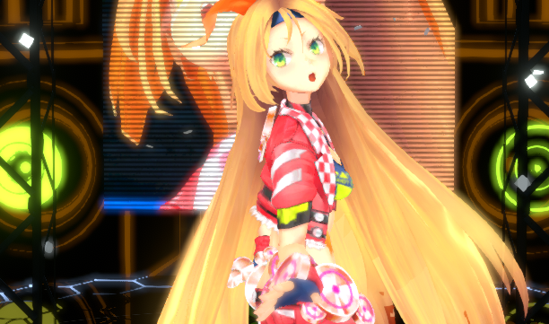
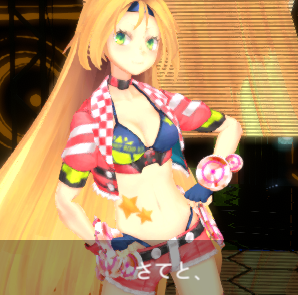

# UnityChan CRS 解読・改造メモ

* Unity2017.3.0f3
* Unity2017.2.0f3

## やり直し
わかりずらくなってきたので新しいシーンで整理する。
新規シーン。

Emptyを作ってTimelineを作成。
UpdatedMethodを``DSP Clock``
Wrap Modeを``Hold``にする。
トラックを削除。

## UnityChanと曲の開始タイミング
シーンに``Assets/UnityChan/Prefabs/CandyRockStar``プレハブをインスタンス化。
Animatorからコントローラーを取り外し。
AnimationTrackを作成してCandyRockStarをバインド。``Assets/UnicyChan/Animations/C86unitychan_003_NOT01_Final/003_NOT01_Final``アニメーションクリップを投入。

AudioTrackを作成して``Aasets/UniteInTheSky/Unite In The Sky(full)``オーディオクリップを投入。

再生しながら曲の開始タイミングがモーションに合うように調整する。
* 900フレームくらいのUnityちゃんが上を向いて動き出すたあたり
* 1860フレームくらいの歌い出し

を繰り返し再生してこの辺かなというところに決めた。

* 126フレームにした(60フレーム換算で2秒くらいなので元々そんなもんである)
* やっぱ120フレームに。LipSyncを少しずらした

アニメーショントラックを基準として曲のタイミングが合うようになった。

``Assets/UniteInTheSky/Prefabs/LipSyncController``プレハブをインスタンス化。
Animatorからコントローラーを取り外し。
AnimationTrackを作成してLipSyncControllerをバインド。``Assets/UnityInTheSky/Animations/LipSync/Take 001``アニメーションクリップを投入。

モーションを止めて口パクと曲のタイミングを眺めてタイミングを決めた。

* Lipsync: 12フレーム

UnityChanのモーションのトラックに``Add Overlay Track``する。トラックのAvatarMaskに``HandOnlyMask``をセット。
``Assets/UnityChan/Animations/Hand_Expression/HandExpression``アニメーショントラックを投入。

見切れないようにCinemachineのVirtualCameraを設置。
vcamの``Look At``に``CandyRockStar/Character1_Reference/Hips/Spine/Spine1/Spine2/Camera Target``をセット。



何もないUnity空間で音楽に合わせてユニティちゃんが踊るようになった。
LipSyncとHandExpressionは動いている。
パーティクルもタイムラインに乗せられるらしいので曲に合わせてOn/Offしようかと思ったのだけどうまくいかなかったので後回しに。

## 表情トラックを作ろう

もともと以下のような流れで表情は制御されていた。

* HandExpressionアニメーションクリップ 
* => アニメーションクリップイベント 
* => FaceUpdate.OnCallChangeFace(state_name) 
* => Animator.CrossFade(state_name, 0)



* => stateにセットされたアニメーションクリップが作動。
* => 表情用のアニメーションクリップ群は、ひとつだけキーが打ってあってBlendShapeの設定値が記述されている。
* => SkinnedMeshRendererのBlendShape値が変更される。

HandExpressionのアニメーションクリップを眺めるとそこまで激しく表情が変化しているわけではないので、
トラック化してタイムラインに移植してみよう。

* FaceUpdate.animationsに設定してあるAnimationClipをScriptableObject化
* ScriptableObjectをクリップとしてSkinedMeshRendererに適用するトラック
* HandExpressionアニメーションクリップからアニメーションクリップイベントを取り出してBlendShapeTrackに投入してScriptableObjectを設定する補助スクリプト 

を作った。


表情が変化するようになった


[ソース](../Assets/_Custom/Scripts/BlendShapeClip)

**トラックを作るときはClipとTrackのクラス名とファイル名が一致しなければならない**。
トラック名の不一致は何のメッセージもなく保存したトラックが、次回ロード時に消滅する。

## EyeTarget

カメラ目線にすべく調べてみると、DeltaLookAtAxisというのがUnityちゃんに含まれているとあり実際動かすことができた。

```cs
public class LookAtTarget : MonoBehaviour
{
    [SerializeField]
    DeltaLookAtAxis[] m_eyeLocators;

    void LookAt(Transform eye, Transform target)
    {
        var dir = (target.position - eye.position).normalized;
        var d = Quaternion.FromToRotation(eye.forward, dir);
        eye.transform.rotation *= d;
    }

    void Update()
    {
        foreach (var x in m_eyeLocators)
        {
            LookAt(x.transform, transform);
        }
    }
}
```

* Multiplyer x=0.2
* Multiplyer y=0.1

くらいの設定がよさげだった。
もう少し調べると不通にMecanimHumanoidのLookAt IKでいけるとあったのでそっちもやってみた。

```cs
public class IKUpdater : MonoBehaviour
{

    [SerializeField]
    Animator m_animator;

    [SerializeField]
    Transform m_lookAt;

    [SerializeField, Range(0, 1)]
    float m_lookAtWeight;

    private void Reset()
    {
        m_animator = GetComponent<Animator>();
        m_lookAt = Camera.main;
    }

    private void OnAnimatorIK(int layerIndex)
    {
        Debug.Log("OnAnimatorIK");
        m_animator.SetLookAtWeight(m_lookAtWeight);
        m_animator.SetLookAtPosition(m_lookAt.position);
    }
}
```

LookAt更新用に作ったのだけど、``OnAnimatorIK``が呼ばれなかった。
・・・タイムラインを使っているときにIKを使えるのかよくわからないな。
わかったら使うとしてとりあえずDeltaLookAtAxisを使う。



ついでにAutoBlinkを有効にした。
ずっとAutoBlinkだとBlendShapeと干渉する場合があるのでActivationTrackを追加して、Unityちゃんが``default@unitychan``の時だけAutoBlinkが有効になるようにしてみた。

## 背景
``Assets/UnityChanStage/Prefabs/Stage``プレハブをインスタンス化。
せっかくなので各オブジェクトの構成もチェックしよう。

### Stage/OrbitInnerとOrbitOuter
* ConstantMotionで輪っかが回る。
* Material GearでReactorの値をマテリアルに伝える？
* Reactorは``Spectrum 2``という名前で``Assets/UnityInTheSky/Prefabs/MusicPlayer``プレハブに含まれている。
* ReactorはAudioSource => OnAudioFilterRead => 音量みたいな感じで音量に応じてマテリアルを変化させている。

### Stage/OribtInner/orbitFX1_core
* VariableMotionで輪っかの上をレーザー発射器が移動する。

### Stage/OrbitInner/orbitFX1_core/LaserGun
* 最初はdisable。Enableになるとレーザーを発射する。

なるほど。オーディオ回りはそのままセットアップして輪っかの動きはタイムラインに乗せてみよう。

AudioSourceを削除して``Assets/UnityInTheSky/Prefabs/MusicPlayer``プレハブをインスタンス化。
オーディオトラックに``MusicPlayer/Main``をバインド
オーディオトラックを４つ複製。``MusicPlayer/Spectrum 1, 2, 3, 4``をバインド。

ActivationTrackを作成。LaserGunをバインド。
曲の途中から適当に発射するようにクリップを作成。

ConstaintMotionがITimeControlを実装するようにして、アニメーション時間をTime.deltaではなくITimeControl.SetTime経由になるように改造してやる。
ControlTrackを作成。OrbitInnerをバインド。クリップを作成。ControlActivationのチェックを外す。前奏が終わったあたりから動き始めるようにしてみた。

VariableMotionも同様に改造してControlTrackに乗せてみた。

Timelineのシークバーの動きに応じて輪っかが動くようになった。



### Stage/StageEffectsGroup
ActivationTrackを作成。LaserGunをバインド。
曲の途中から適当に発射するようにクリップを作成。

ActivationTrackを作成。SonicBoomをバインド。
曲の途中から適当に発射するようにクリップを作成。

### Stage/StageObjectGroup
建物。

### Confetti
``Assets/UnityChanStage/Prefabs/Confetti``プレハブをインスタンス化。
ControlTrackを作成。クリップを作成してConfetti/ParticleSystemをセット。
２組作る。
こっちのParticleSystemはControlTrackに乗った。

### BackScreenとBackScreenCameraRig
``Assets/UnityChanStage/Prefabs/BackScreen``プレハブをインスタンス化。
``Assets/UnityChanStage/Prefabs/BackScreen Camera Rig``プレハブをインスタンス化。

### Background
建物の外の遠景と天球。

### Visualizer
ミラーな床。

## ポストエフェクト
前の設定を復活。



## LogoのScreenOverlay復活

* [これで](https://qiita.com/ousttrue/items/ac2f0b3847e76a36b1f0)

## 歌詞トラックを作る

カメラ切替の目印を兼ねて歌詞トラックを作る。



DefaultPlayableのTextSwitcherを改造したもの。

## カメラ切替トラックを作る
Cinemachineの練習にいろんなパターンを試してみる。
Cinemachineのトラックそのままだとカメラのスイッチしかできないので、代わりのトラックを作る。
中心に目標を捉えるように追跡するというより、ゆっくりパンアップするとか、ゆっくりパンするとか、ゆっくりズームするような動きにしたい。
機能的には以下のものを予定。

* zoom
* dofのfocus
* dolly position
* targetの移動(PANするためターゲットの方を移動する)

曲の部分毎にざっくりと設定しよう

|パート|カメラ|
|:----|:-----|
|イントロA|パンアップ|
|イントロB|ズームアウト|
|||
|A|パン|
|B|ズームイン|
|サビ|ロング。ゆっくりズーム| 
|||
|間奏|上から|
|||
|A|横から|
|B|ズーム|
|サビ|ドリー|
|||
|C|ロング|
|||
|サビ|近く|
|||
|エンド|フォーカスアウト|

## memo
* [StageDirectorをTimeline(PlayableDirector)で置き換える](timeline.md)
* [DefaultPayable導入](defaultplayable.md)
* [Post-processing Stack導入](postprocessing.md)
* [Cinemachine導入](cinemachine.md)

以下気になっているところ

* ユニティちゃんトゥーンシェーダー2.0導入
