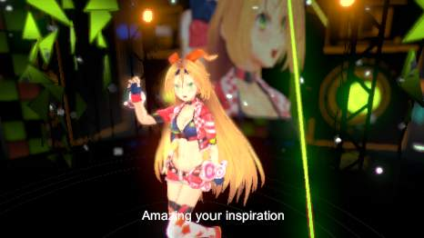

# [Default Playables](https://www.assetstore.unity3d.com/en/#!/content/95266)を取り入れる

Timeline化を果たしたのでDefaultPlayablesで遊んでみよう。

* [【Unity】"Default Playables"で、VideoPlayerやTextをタイムラインで制御したりFadeoutやTweenしたり](http://tsubakit1.hateblo.jp/entry/2017/07/14/215906)

## TextSwitcherTrackで歌詞を入れてみよう

シーンにUI - Textを作成。TextのTransformをResetして画面中央にして、Textを空文字列にする。
SceneViewを2DにするとAssets/Visualizer/MirroRefectionからエラメッセージが出るようになってしまうので対処

```
Assertion failed: Screen position out of view frustum (screen pos 1024.000000, 0.000000, 1030676.000000) (Camera rect 0 0 1024 1024)
```

```cs
	public void OnWillRenderObject()
	{
		if (!enabled || !GetComponent<Renderer>() || !GetComponent<Renderer>().sharedMaterial || !GetComponent<Renderer>().enabled)
			return;

		Camera cam = Camera.current;
		if (!cam)
			return;

        // ここ追加
        if (cam.orthographic)
        {
            return;
        }
```

TimelineにDefault Playablesで追加された``Text Switcher Track``を追加。オブジェクトに最初に作った``UI-Text``を設定。
再生して指定のタイミングでテキストが表示されることを確認できた。

[Unityちゃん](http://unity-chan.com/)からキャラクターソング・アルバム Vol.1「UNITE IN THE SKY」入手。

裏ジャケットに書いてある歌詞をテキストに起こして曲を聴いてだいたいの時間を追加した。

```
[00:27]存在的には 潜在？
頭の中は 無限大∞
[00:31]混沌都市 現代に
うれしはずかし 木霊し 参りまして
```

手で全部入力するのも何なのでテキストからTextSwitcherTrackにTextSwitcherClipを投入するツールを作ってみる。
Editorで完結させたいところだがとりあえずプレイしたら動作するものを作った。

* [TimelineAssetをEditor用Scriptから生成するメモ](https://qiita.com/furai13/items/d2048d49dde45823b3de)

TimlineClipを作って時間を指定するところまではできたが、
TextSwitcherClipに固有のtext等を設定する方法がわからんかった。


* [TextSwitcherTrackUtil](../Assets/TextSwitcherTrackUtil.cs)

わかったら更新する。
残念。



## なんとなくわかった？
スクリプトからTextSwitcherClipに値を入れる方法がわかった。

* Assets/DefaultPlayables/TextSwitcher/Editorを削除
* Assets/DefaultPlayables/TextSwitcher/TextSwitcherClipを改造

```cs
[Serializable]
public class TextSwitcherClip : PlayableAsset, ITimelineClipAsset
{
    public ClipCaps clipCaps
    {
        get { return ClipCaps.Blending; }
    }

    public Color color = Color.white;
    public int fontSize = 14;
    public string text;

    public override Playable CreatePlayable(PlayableGraph graph, GameObject owner)
    {
        var playable = ScriptPlayable<TextSwitcherBehaviour>.Create(graph);
        var behaviour = playable.GetBehaviour();
        behaviour.color = color;
        behaviour.fontSize = fontSize;
        behaviour.text = text;
        return playable;
    }
}
```

DefaultPlayablesが本体の更新に追随できてないんじゃないかとか推察。
作った時には、PlayableAssetのpublic fieldがクリップのインスペクタに表示される機能が無かったんではないかと。
2017.2ではPlayableAssetのpublic fieldがインスペクタに表示されるのでこっちに設定項目を入れておいて、
PlayableBehaviourに``CreatePlayable``で値をセットしてやるというスタイルになったんでないか。
情報が少なくてよくわからぬ。

``TextSwitcherTrack.GatherProperties``もなんかエラーが出るので削除してよいのではないか。

## [Timeline (Unity 2017b5) Fade sample](https://gist.github.com/tsubaki/841bf990affab423b80ff4c5949670f9)

PostProcessingStack導入で消してしまったScreenOverlayの代替品を作れる。

* PlayableBehaviour(Mixer) => Playable
* PlayableAsset(Clip) => Timeline用
* PlayableTrack => Timeline用

となっていて作るとTimelineで右クリックするとPlayableTrack名のトラックの追加メニューが出現する。
