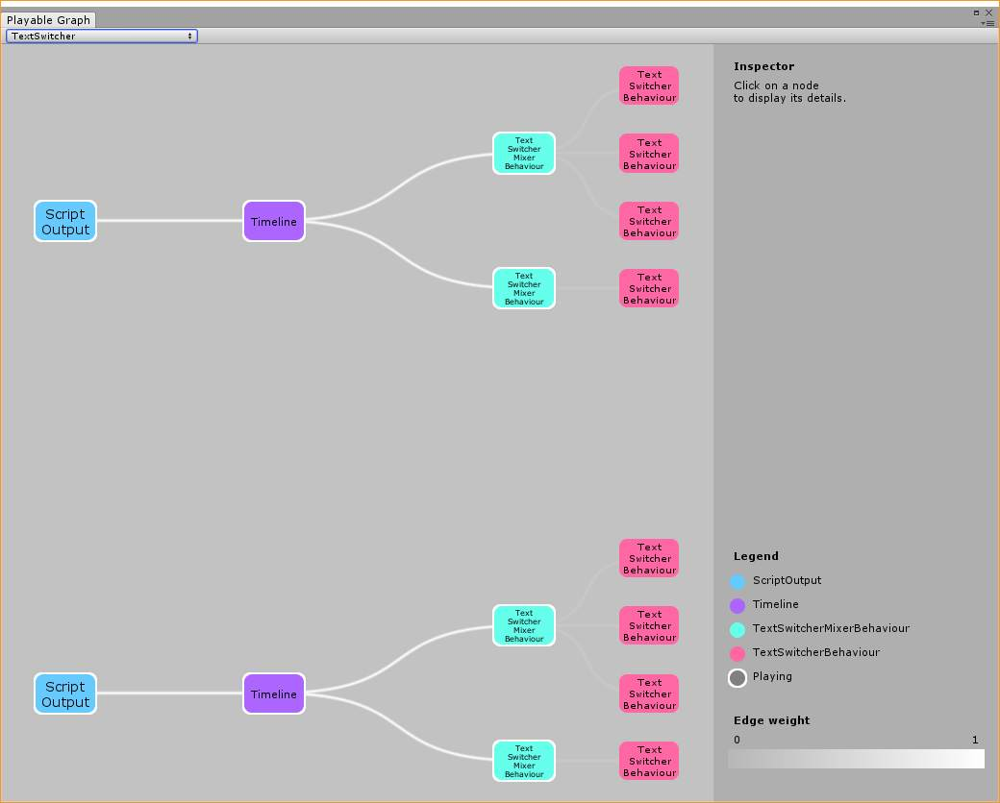

# [Playables API](https://docs.unity3d.com/Manual/Playables.html)

2017.1から登場。

タイムライン(PlayableDirector)を使う場合でも、自前のトラックを実装するもしくはスクリプトでタイムラインを操作するにはある程度理解した方がよさげ。

## Visualizer

* https://github.com/Unity-Technologies/graph-visualizer

## [PlayableGraph](https://docs.unity3d.com/Manual/Playables-Graph.html)

PlayableGraphはTree構造で``output``をrootとして、``clip``をplayableとする。
単純な例。

```cs
[SerializeField]
AnimationClip m_clip;

[SerializeField]
Animator m_animator;

void Start()
{
    [SerializeField]
    AnimationClip m_clip;

    [SerializeField]
    Animator m_animator;

    PlayableGraph m_graph;
    void Start()
    {
        // build graph
        m_graph = PlayableGraph.Create();

        var output = AnimationPlayableOutput.Create(m_graph, "output", m_animator);

        var playable = AnimationClipPlayable.Create(m_graph, m_clip);

        output.SetSourcePlayable(playable);

        // play graph
        m_graph.Play();
    }
}
```

outputにひとつだけplayableが連結されている。

## Playableを自作する

* https://docs.unity3d.com/Manual/Playables-ScriptPlayable.html

```cs
public class MyPlayableBehaviour : PlayableBehaviour
{
}
```

```cs
    PlayableGraph m_graph;

    private void Start()
    {
        m_graph = PlayableGraph.Create();

#if false
        var playable=ScriptPlayable<MyPlayableBehaviour>.Create(m_graph);
#else
        var myPlayable = new MyPlayableBehaviour();
        ScriptPlayable<MyPlayableBehaviour>.Create(m_graph, myPlayable);
#endif
    }
```

自作のPlayableOutputは？

## [Timeline](https://docs.unity3d.com/Manual/TimelineSection.html)

* https://docs.unity3d.com/Manual/TimelineOverview.html

で、PlayablesAPIを使うインターフェースとしてTimelineがあるっぽい。
TrackひとつがPlayableGraphひとつに相当する？

TimelineEditorWindowで編集するとPlayableDirectorが保持するTimelineAssetが変更され、シーン内のオブジェクトのBindingが変更される。
TimelineAssetはProjectに保存され、Bindingはシーンに保存される。




同じグラフが２つできているのは良くわからないが、``ScriptOutput``-``Timeline``までがデフォルトで、その１つ右がトラックひとつひとつに対応し、その右がクリップひとつひとつに対応する様子。

