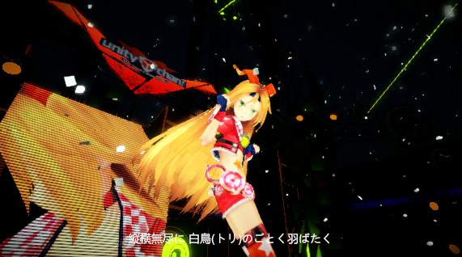

# [Post Processing Stack](https://docs.unity3d.com/Manual/PostProcessing-Stack.html)の導入

* https://www.assetstore.unity3d.com/jp/#!/content/83912

* [Unity5.6のImageEffects消えた話と新エフェクトPost Processing Stack](https://thattown.wixsite.com/thattown/single-post/2017/06/07/Unity56%25E3%2581%25AEImageEffects%25E6%25B6%2588%25E3%2581%2588%25E3%2581%259F%25E8%25A9%25B1%25E3%2581%25A8%25E6%2596%25B0%25E3%2582%25A8%25E3%2583%2595%25E3%2582%25A7%25E3%2582%25AF%25E3%2583%2588Post-Processing-Stack)

PostProcessingStackと旧ImageEffectと入れ替えてみる。

## 旧ImageEffectの取り外し

``MainCameraRig/CameraSwitcher/ManCamera``を選択して、GUILayer, Flare Layer, Global Fog, Depth Of Field Scatter, Bloom, Vignetting, Antialiasing As Post Effect, Jitter Motion, Screen Overlayを削除。StageDirectorのScreenOverlaysを空にする。
再生してみるとGameViewがSceneViewと同じような絵になった。

ついでなのでImageEffectの入っているStandardAssetフォルダを削除する。
ImageEffectにアクセスしているコードも取り除く。

* StageDirector
* WaitingRoom
* CameraSwitcher

再生して動作確認。

JavaScriptで記述されていた旧ImageEffect周りのコードが原因でVisuaslStudioからUnityにアタッチできなかったのが解消されてステップ実行できるようになった。削除したのはこれが目的。

## PostProcessingStack

### v2

* https://github.com/Unity-Technologies/PostProcessing/releases

から``Post-processing Stack 2.0.0-Beta4``を入手する。

* https://github.com/Unity-Technologies/PostProcessing/wiki/(v2)-Quickstart

Cameraに``PostProcessingLayer``コンポーネントをアタッチ。
GlobalVolume
add effect


### V1 memo

AssetStoreからImport。
ProjectにPostProcessProfileを作成。
CameraにPostProcessBehaviourをアタッチしてPostProcessProfileをセット。

早速設定してみる。

* GUILayer -> 無い。多分不要
* Flare Layer -> 無い
* Global Fog -> Fog
* Depth Of Field Scatter -> Depth Of Field。あとでCameraSwitcherにあった距離設定をPostProcessingStack向けに復活させる。
* Bloom -> Bloom
* Vignetting -> Vignetting
* Antialiasing As Post Effect -> Antialiasing
* Jitter Motion -> 無い。Cinemachineでできるんでないか。
* Screen Overlay　-> 無い

とりあえず設定してみた。
DOFの目標距離を設定するコードをCameraSwitcher.Updateに追加。

```cs
        // Update DOF
        if (m_postprocessing != null)
        {
            var settings = m_postprocessing.profile.depthOfField.settings;
            m_postprocessing.profile.depthOfField.settings = new UnityEngine.PostProcessing.DepthOfFieldModel.Settings
            {
                focusDistance = (target.transform.position - transform.position).magnitude,
                aperture = settings.aperture,
                focalLength = settings.focalLength,
                kernelSize = settings.kernelSize,
                useCameraFov = settings.useCameraFov,
            };
        }
```



なんかそれっぽい感じに。

## 調整

* https://github.com/Unity-Technologies/PostProcessing/wiki

ToDo

## 床の鏡をScreenSpaceReflectionで置き換えてみる

ToDo

