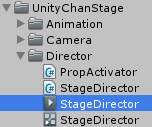
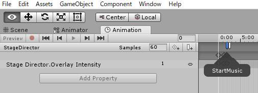
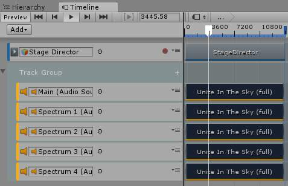
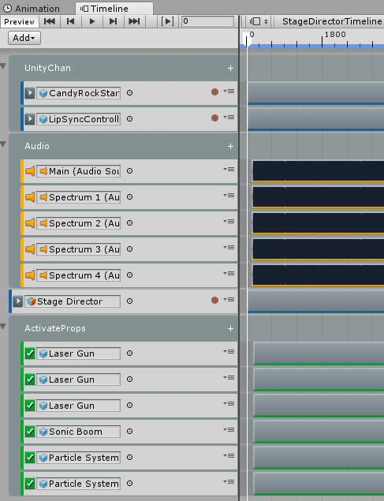
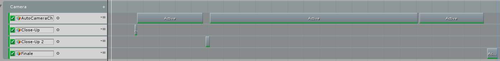

# Assets/UnityChanStage/Director/StageDirector.csを[PlayableDirector](https://docs.unity3d.com/Manual/class-PlayableDirector.html)に置き換えてみる

[プロジェクトの基本構造について](https://github.com/unity3d-jp/unitychan-crs/wiki)の解説によると

> Stage Director はアニメーションカーブとアニメーションイベントによって制御されています。

とある。



なるほど。

StageDirector.csを読むとAwakeで各種Prefabのインスタンス化と、アニメーションクリップStageDirectorから発生するアニメーションイベントを受け付けていることがわかった。

StartMusic, ActivateProps, SwitchCamera(int 0), StartAutoCameraChange, StopAutoCameraChange, SwitchCamera(int 1), FastForward, StartAutoCameraChange, StopAutoCameraChange, StartAutoCameraChange, StopAutoCamraChange, SwitchCamera(int 2), EndPerformanceが設定されていた。

やってみよう。

## 新規タイムライン

Timeline Windowを開いてヒエラルキーでStageDirectorを選択して、Timeline Windowのcreateを押す。Assets/StageDirectorTimeline.palyableで保存した。
Timelineのトラックに、StageDirectorアニメーションクリップを投入。
これでTimelineからStageDirectorのAnimatorを駆動するようになったので、AnimatorからControllerを取り除く。
再生してみる。
StageDirectorのOverlayIntensityに注目していると値が流れ込んでいることがわかる。
・・・しかし、音が鳴らぬ。
どうやらアニメーションクリップイベント(StartMusic)が来ていないぽい。
使い方が悪いのか現状そういうものなのかよくわからないが、イベントはTimeline上に別のトラックとして移植していくことにしよう。

## MusicPlayer

MusicPlayerプレハブをシーンにインスタンス化。
StageDirector.csからMusicPlayerのプレハブをインスタンス化するコードを削除。
TimelineにAudioトラックを追加して``Unite In The Sky(full)``を投入。
StageDirectorアニメーションクリップのStartMusicのタイミングを確認して、``Unite In The Sky(full)``クリップの始まる時間を2秒に設定。
AudioトラックのAudioSourceにMusicPlayerの子オブジェクトMainを設定。
再生してみる。
・・・曲と踊りのタイミングがあっていないような。
PlayableDirectorのUpdate Methodを音楽と合うように``DSP Clock``にした。
Spectrum 1, 2, 3, 4用のAudioTrackをコピペで追加した。



## CandyRockStarとLipSyncController(Prefabs On Timeline)

次はUnityちゃんをタイムラインに乗せてみよう。

* [Candy Rock Star をさわってみた#05 ～ ユニティちゃんのアニメ連動移動制御](https://dennou-note.blogspot.jp/2014/12/candy-rock-star-05.html)

CandyRockStarとLipSyncControllerプレハブをシーンにインスタンス化する。
TimelineにAnimationTrackを追加して``UnityChan/Animations/C86unitychan_003_NOT01_Final/003_NOT01_Final``アニメーションクリップを投入し、アニメーターにCandyRockStarを設定。
同様にAnimationTrackを追加して``UnityInTheSky/Animation/LipSync/Take001``アニメーションクリップを投入し、アニメーターにLipSyncControllerを設定。
CandyRockStarとLipSyncControllerのAnimatorからControllerを取り除く。
再生してみる。
それなりいうまく動いてタイムラインをシークすると音楽とモーションが同期するようになった。
しかし、UnityChanが最初目を閉じなくなったなど微妙に動きが不完全。
もともとAnimatorで設定していたアニメーションレイヤーFaceとHandExpressionが無い状態になったためだ。

## HandExpressionとFace

* https://www.slideshare.net/nyaakobayashi/making-of-in-comicmarket-86

HandExpressionレイヤーにHandExpressionモーションを適用していることがわかった。
Timelineでレイヤーを使うにはAvatarMaskに同じものを適用すればよさげだが・・・

CandyRockStarアニメーショントラックにOverlayトラックを追加。AvatarMask ``UnityChan/Animators/HandOnlyMask``を適用。HandExpressionアニメーションクリップを投入。
手がアニメーションするようになった。
このHandExpressionアニメーションクリップにアニメーションイベントとして表情変更イベントOnCallChangeFaceが定義されている。 CandyRockStarにアタッチされているFaceUpdate.OnCallChangeFace関数の実行が期待されるが現状動かず。FaceUpdate.OnCallChangeFaceからAnimatorControllerのFaceレイヤーに処理が流れるので、Timeline化したときにAnimatorControllerを取り除いたことで動かなくなっている。BlendShapeをTimelineと親和性の高い形で駆動する方法をなんか考えよう。

## ActivatePropsをタイムラインに乗せる

StageDirectorを読むと、prefabsNeedsActivationに設定されたプレハブをインスタンス化して、ActivatePropsイベントに応じてBroadcastMessage("ActivateProps")するというコードがある。StageDirectorアニメーションクリップをチェックすると開始から2.5秒のところで、ActivatePropsアニメーションイベントが発行される。プロジェクトを"ActivateProps"で検索すると``UnityChanStage/Director/PropActivator.cs``がActivateProps関数を持っていることがわかる。PropActivatorは、ActivatePropsで子オブジェクトのSetActive(true)を呼び出す。

* StageプレハブととConfetteプレハブをインスタンス化
* StageDirectorアニメーションクリップ
* 2.5秒 -> アニメーションイベント -> "ActivateProps"
* StageDirector.ActivateProps関数を実行
* StageとConfetteに"ActivateProps"メッセージが投げられる
* StageとConfetteの子孫にアタッチされたPropActivatorのActivateProps関数を実行
* StageとConfetteの子オブジェクトがSetActive(true)される

これをタイムラインのActivationTrackに置き換えてみる。
Stageプレハブをインスタンス化。ActivationTrackを追加。ActivationTrackの開始時間を2.5秒に終了をモーションと同じにする。ActivationTrackに``Stage/Orbit Inner/orbitFX1_core/Larser Gun``を設定。再生してみる。背景のレーザーのひとつが2.5秒でONになるようになった。
全部で６つのActivationTrackを設定した。

* Stage/Orbit Inner/orbitFX1_core/Larser Gun
* Stage/Orbit Outer/orbitFX2_core/Larser Gun
* Stage/Stage Effects Group/Larser Gun
* Stage/Stage Effects Group/Sonic Boom
* Confetti/Particle System
* Confetti/Particle System



あと、StageDirectorからはインスタンス化以外のことをしていないMiscPrefabsをシーンにインスタン化した。
Back Screen, Back Screen Camera Rig, Background, Character Light, Visualizerの５つ。

## MainCameraRigをインスタンス化してカメラ制御をタイムラインに乗せる
MainCameraRigをシーンにインスタンス化する。
StageDirectorからカメラ関連のコードを削除する。
StageDirectorアニメーションクリップが更新するStageDirector.overlayIntensityをScreenOverlayに反映するだけの単機能スクリプトになった。

```cs
using UnityEngine;


public class StageDirector : MonoBehaviour
{
    #region ScreenOverlay
    // Objects to be controlled.
    public ScreenOverlay[] screenOverlays;

    // Exposed to animator.
    public float overlayIntensity = 1.0f;

    void Update()
    {
        foreach (var so in screenOverlays)
        {
            so.intensity = overlayIntensity;
            so.enabled = overlayIntensity > 0.01f;
        }
    }
    #endregion

    #region AnimationClip Events
    public void StartMusic()
    {
        Debug.Log("StartMusic");
    }

    public void ActivateProps()
    {
        Debug.Log("ActivateProps");
    }

    public void SwitchCamera(int index)
    {
        Debug.LogFormat("SwitchCamera: {0}", index);
    }

    public void StartAutoCameraChange()
    {
        Debug.Log("StartAutoCameraChange");
    }

    public void StopAutoCameraChange()
    {
        Debug.Log("StopAutoCameraChange");
    }

    public void EndPerformance()
    {
        Debug.Log("EndPerformance");
        Application.LoadLevel(0);
    }
    #endregion
}
```

カメラ関連のアニメーションクリップイベントは2種類あって、SwitchCamera(int)とStart・StopAutoCameraChangeだ。
ActivationTrackに乗せるべくスクリプトを作成した。

```cs
using UnityEngine;

public class CameraPosition : MonoBehaviour {

    [SerializeField]
    CameraSwitcher m_switcher;

    private void OnEnable()
    {
        m_switcher.ChangePosition(transform);
    }
}

using UnityEngine;

public class AutoCameraChange : MonoBehaviour {

    [SerializeField]
    CameraSwitcher m_switcher;

    private void OnEnable()
    {
        m_switcher.StartAutoChange();
    }

    private void OnDisable()
    {
        m_switcher.StopAllCoroutines();        
    }
}
```

CameraPositionStageDirector.CameraPointsに設定されていたClose-Up, Close-UP2, FinareにセットしてMainCameraRig/CameraSwitcherをセットしそれぞれのGameObjectをDisableにする。
AutoCameraChangeをCreateEmptyして設定し、Disableにする。
StageDirectorアイメーションクリップのイベントのタイミングを調べる。

* 14.5秒 SwitchCamera 0
* 16.0秒 StartAutoCameraChange 
* 57.2秒 StopAutoCameraChange
* 58.8秒 SwitchCamera 1
* 61.5秒 StartAutoCameraChange
* 191.0秒 StopAutoCameraChange
* 191.8秒 StartAutoCameraChange
* 232.0秒 StopAutoCameraChange
* 234.0秒 SwitchCamera 2

ActivationTrackを作成し、Start・StopAutoCameraChangeのタイミングで３つクリップをセットする。
ActivationTrackを３つ作成しSwitchCamera0, 1, 2をセットする。



曲終了時にシーン遷移するのも作った。

* 240.0秒 EndPerformance

```cs
using UnityEngine;
using UnityEngine.SceneManagement;

public class EndPerformance : MonoBehaviour {

    private void OnEnable()
    {
        SceneManager.LoadScene(0);
    }
}
```

これが発動するとシーンがリロードされて最初に戻る。
ここまででStageDirectorをTimelineに置き換えて見通しが良くなったと思う。

